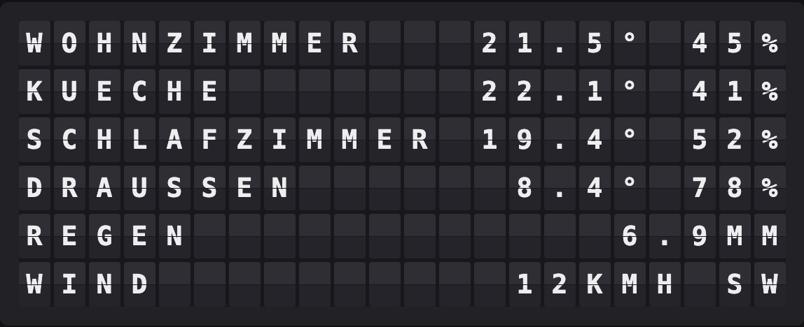
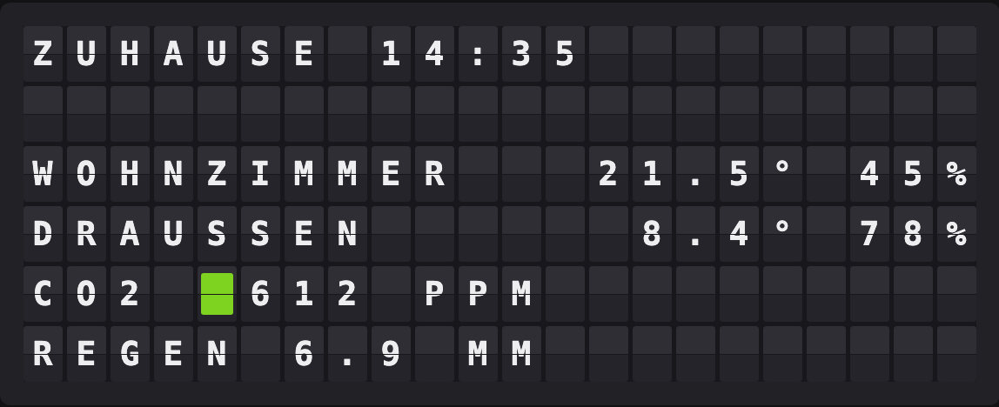

# Netatmo Weather Plugin

Put a Netatmo Weather Station on the board — one module per row, name on the left, reading on the right.



**→ [Setup Guide](./docs/SETUP.md)**

## Overview

The plugin reads `getstationsdata` for the account you connect and turns every module into a board row: indoor rooms and the main unit show temperature, the outdoor module shows the temperature outside, the rain gauge shows the last 24 hours, the wind gauge shows speed and direction.

The layout is built for the board it is rendering on. A Flagship (22×6) fits six modules with humidity next to each temperature; a Note (15×3) fits three, and drops the second reading rather than shortening the room names. The module order is yours, so the three that survive on a Note are the three you ranked first.


Modules are chosen from a picker fed by the account itself — no module ids to copy by hand — and each one can carry a short name for the board, because "Wohnzimmer Erdgeschoss" is 23 tiles before a single degree is shown.

The plugin reads the Weather Station only. Thermostats, valves, cameras and the Healthy Home Coach share the same account but not this endpoint.

## Template Variables

### Station

| Variable | Description | Example |
|----------|-------------|---------|
| `{{netatmo_weather.station}}` | Station name as Netatmo has it | `ZUHAUSE` |
| `{{netatmo_weather.updated}}` | Local time of the most recent measurement | `14:35` |
| `{{netatmo_weather.age}}` | Minutes since that measurement | `6` |
| `{{netatmo_weather.module_count}}` | How many modules the layout is showing | `4` |
| `{{netatmo_weather.temp_unit}}` | Unit suffix for temperatures, board-aware | `°C` |

### Indoor

| Variable | Description | Example |
|----------|-------------|---------|
| `{{netatmo_weather.indoor_name}}` | Name of the module the indoor variables come from | `WOHNZIMMER` |
| `{{netatmo_weather.indoor_temp}}` | Indoor temperature, no unit suffix | `21.5` |
| `{{netatmo_weather.indoor_humidity}}` | Indoor relative humidity in percent | `45` |
| `{{netatmo_weather.indoor_co2}}` | Indoor CO2 in ppm | `612` |
| `{{netatmo_weather.indoor_noise}}` | Noise in dB — the main unit measures it, add-on modules do not | `37` |
| `{{netatmo_weather.indoor_trend}}` | Temperature trend: `+` rising, `-` falling, `=` stable | `+` |
| `{{netatmo_weather.pressure}}` | Air pressure in mbar or inHg | `1017` |
| `{{netatmo_weather.pressure_trend}}` | Pressure trend | `-` |

### Outdoor

| Variable | Description | Example |
|----------|-------------|---------|
| `{{netatmo_weather.outdoor_name}}` | Name of the outdoor module | `DRAUSSEN` |
| `{{netatmo_weather.outdoor_temp}}` | Outdoor temperature, no unit suffix | `8.4` |
| `{{netatmo_weather.outdoor_humidity}}` | Outdoor relative humidity | `78` |
| `{{netatmo_weather.outdoor_min}}` / `{{netatmo_weather.outdoor_max}}` | Today's low and high | `3.6` / `11.2` |
| `{{netatmo_weather.outdoor_trend}}` | Temperature trend | `-` |

### Rain & Wind

| Variable | Description | Example |
|----------|-------------|---------|
| `{{netatmo_weather.rain_hour}}` | Rain in the last hour, mm or inches | `0.4` |
| `{{netatmo_weather.rain_today}}` | Rain in the last 24 hours | `6.9` |
| `{{netatmo_weather.wind}}` | Wind speed in km/h or mph | `12` |
| `{{netatmo_weather.wind_gust}}` | Strongest gust | `27` |
| `{{netatmo_weather.wind_from}}` | Direction as an eight-point compass label | `SW` |

### Board Lines

| Variable | Description | Example |
|----------|-------------|---------|
| `{{netatmo_weather.block}}` | The whole laid-out board as one value, rows separated by newlines | `WOHNZIMMER 21.5° 45% ␤ …` |
| `{{netatmo_weather.line1}}` … `{{netatmo_weather.line6}}` | The same rows individually, padded to the board width | `WOHNZIMMER   21.5° 45%` |
| `{{netatmo_weather.modules.0.name}}` | Per-module array: `name`, `temp`, `humidity`, `co2`, `battery`, `trend`, `line` | `WOHNZIMMER` |

A measurement the station did not report comes out as an empty string, not a placeholder — a station with no rain gauge leaves `rain_today` blank rather than printing `0`.

## Example Templates

The plugin already lays itself out for the board, so the simplest setup is a **single-plugin page** with no template at all.

Inside a template page, put `block` on the **first** line and leave the rest empty. FiestaBoard splits a value containing newlines across the board rows, so this reproduces the same layout:

```text
{{netatmo_weather.block}}
```

The rows come out padded to the full board width, so the page's own alignment setting leaves them untouched.

### Sample page: two rooms, CO2 and the rain

Build the rows yourself when the board is shared with something else. With the living room and the outdoor module selected, in that order:

```text
{{netatmo_weather.station}} {{netatmo_weather.updated}}

{{netatmo_weather.line1}}
{{netatmo_weather.line2}}
CO2 {{netatmo_weather.indoor_co2}} PPM
REGEN {{netatmo_weather.rain_today}} MM
```



`indoor_co2` and `outdoor_temp` ship with color rules, so the CO2 reading is green below 800 ppm, yellow past 800, orange past 1000 and red past 1400 — no template syntax needed, the colored tile is prepended for you. Both are editable per board under the plugin's color settings.

### Don't do this

```text
{{netatmo_weather.line1}} {{netatmo_weather.line2}}
```

`line1`…`line6` are padded to the full board width, so two of them on one line push the second one off the board. Use the variables from the groups above when composing your own row.

## Configuration

| Setting | Type | Default | Description |
|---------|------|---------|-------------|
| `enabled` | boolean | `false` | Enable the plugin |
| `client_id` | string | *(empty)* | From your app at [dev.netatmo.com](https://dev.netatmo.com) |
| `client_secret` | string | *(empty)* | From the same app |
| `refresh_token` | string | *(empty)* | Generated in the app's token generator with the `read_station` scope |
| `modules` | array | *(empty)* | Which modules to show, in order. Empty means all of them |
| `module_names` | object | `{}` | Optional short name per module, filled in from the picker |
| `units` | `metric` \| `imperial` | `metric` | Netatmo always reports metric; imperial is converted here |
| `decimals` | `0` \| `1` | `1` | `21` or `21.5` |
| `secondary` | `none` \| `humidity` \| `co2` \| `battery` | `humidity` | Second reading after the temperature |
| `show_trend` | boolean | `false` | Add `+` / `-` / `=` for the temperature trend |
| `degree_sign` | `auto` \| `on` \| `off` | `auto` | Tile 62 prints `°` on a Flagship and a heart on a Note |
| `umlauts` | `expand` \| `strip` | `expand` | `KUECHE` vs. `KUCHE` — the board has no umlaut tiles |
| `timezone` | string | *(empty)* | IANA timezone for `updated`. Empty follows the FiestaBoard-wide timezone |
| `refresh_seconds` | integer | `600` | Poll interval, floored at 300 seconds |

Credentials can also come from `NETATMO_CLIENT_ID`, `NETATMO_CLIENT_SECRET` and `NETATMO_REFRESH_TOKEN`; the settings form wins when both are set.

## Features

- One row per module, laid out for the board it renders on — a Flagship shows six modules with humidity, a Note shows three without
- Detail is chosen for the whole board, not row by row: a column where one row kept a humidity its neighbours dropped reads as a mistake
- Module picker fed from the account itself, with ordering and per-module short names
- Metric and imperial, converted here because Netatmo always reports metric whatever the account displays
- Board-aware degree sign — tile 62 is `°` on a Flagship and a heart on a Note, so `auto` drops it there
- Umlaut handling for a charset that has none: `Küche` → `KUECHE`, `Draußen` → `DRAUSSEN`
- Default color rules for CO2 and outdoor temperature
- Survives Netatmo's rotating refresh tokens across restarts, and repairs the chain when you paste a fresh token
- Quiet modules keep their row and their name instead of vanishing from the board

## Author

Oliver Rummeyer

## Development

The plugin imports `src.plugins.base` from the FiestaBoard core, so tests need the core repo checked out next to this one:

```bash
git clone https://github.com/Fiestaboard/FiestaBoard.git ../FiestaBoard

# Import paths matching how FiestaBoard loads the plugin
mkdir -p plugins && touch plugins/__init__.py
ln -sfn .. plugins/netatmo_weather

python -m venv .venv && .venv/bin/pip install pytest pytest-cov requests
PYTHONPATH=".:../FiestaBoard" .venv/bin/pytest tests/ --cov=. --cov-report=term-missing
```

No test touches the network: the station payload is a fixture, and the two methods that speak HTTP are stubbed.
